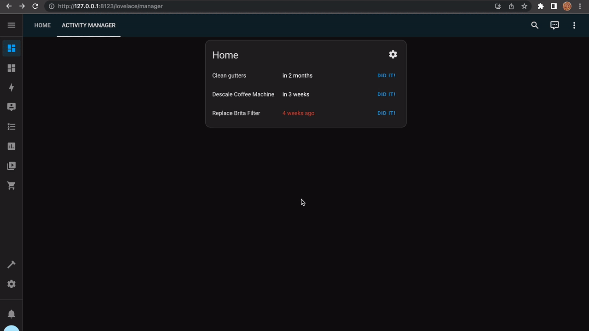

# activity-manager

Manager recurring tasks from within Home Assistant

Use the companion [Activity Manager Card](https://github.com/pathofleastresistor/activity-manager-card) for the best experience.

The core idea is that an activity happens on a recurring basis, which is stored in the `frequency` field when adding an activity. By default, the activity is last completed when you first add the activity and then the timer can be reset.

<p align="center">
  
</p>

## Installation

### Manually

Clone or download this repository and copy the "activity_manager" directory to your "custom_components" directory in your config directory

`<config directory>/custom_components/activity-manager/...`

### HACS

1. Open the HACS section of Home Assistant.
2. Click the "..." button in the top right corner and select "Custom Repositories."
3. In the window that opens paste this Github URL.
4. Select "Integration"
5. In the window that opens when you select it click om "Install This Repository in HACS"

## Usage

Once installed, you can use the link below to add the integration from the UI.

[](https://my.home-assistant.io/redirect/config_flow_start/?domain=activity_manager)

If you're using the [Activity Manager Card](https://github.com/pathofleastresistor/activity-manager-card), then you all you need to do is add the Activity Manager Card to your dashboard. When you're creating the card, you'll have to supply a `category` attribute to the card.

### Notifications

Because entities are exposed for each activity, you can build custom notifications. The example below runs an automation at sunrise to remind the user if they are past due on workout activities:

```
service: notify.mobile_android_phone
data:
  title: >-
    Workout reminders
  message: >-
    {{ "Remember to stay healthy and go do: " }}
    
    <br />
    
    
    {{ new_line() }}{{ " - "}}{{  activity.name }}
    
    
  data:
    priority: high
    ttl: 0
    importance: high
    notification_icon: "mdi:dumbbell"
```

### More information

-   Activities are stored in .activities_list.json in your `<config>` folder
-   An entity is created for each activity (e.g. `sensor.<category>_<activity>`). The state of the activity is the datetime of when the activity is due. You can use this entity to build notifications or your own custom cards.
-   Three services are exposed: `activity_manager.add_activity`, `activity_manager.update_activity`, `activity_manager.remove_activity`. The update activity can be used to reset the timer.
