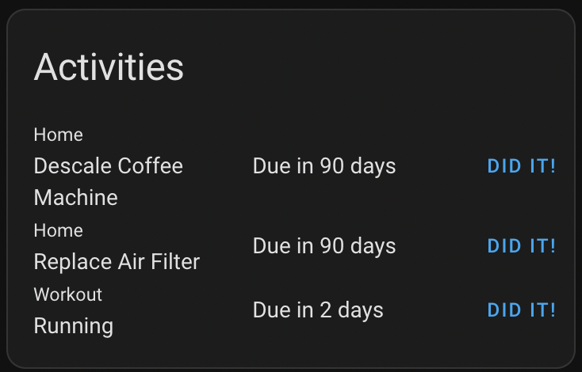
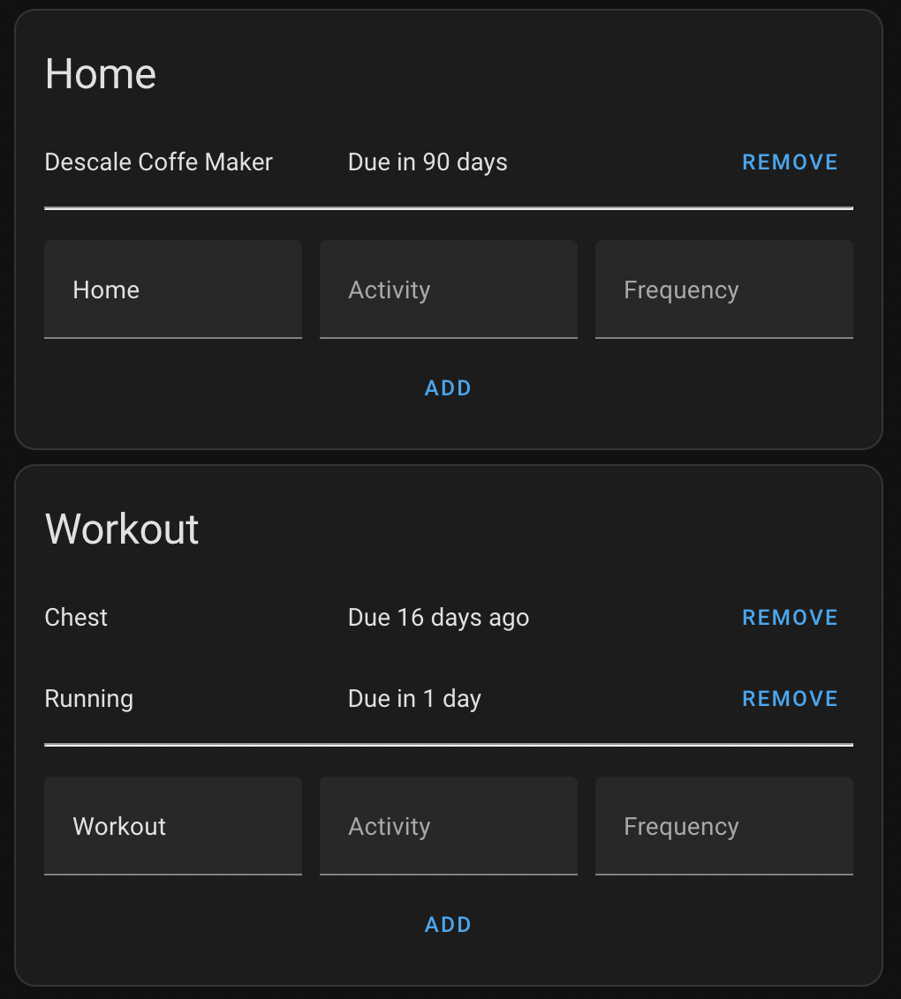
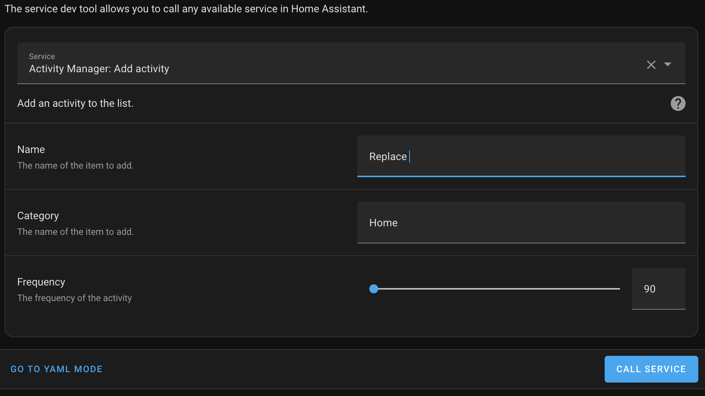

# EARLY RELEASE
This was designed to solve a personal need and I'm now trying to prepare it for others to use. That means several things can break between releases.

# activity-manager

Manager recurring tasks from within Home Assistant

Use the companion [Activity Manager Card](https://github.com/pathofleastresistor/activity-manager-card) for the best experience.

The core idea is that an activity happens on a recurring basis, which is stored in the `frequency` field when adding an activity. By default, the activity is last completed when you first add the activity and then the timer can be reset.

## User Interface
Using the [Activity Manager Card](https://github.com/pathofleastresistor/activity-manager-card) you show your activities and click the "Did it!" button to reset the timer.<p align="center">
  
</p>

Using the [Activity Manager Card](https://github.com/pathofleastresistor/activity-manager-card) you can manage activities directly from the UI.
<p align="center">
  
</p>

Services are exposed for you to manage your activities.
<p align="center">
  
</p>

## Installation

### Manually

Clone or download this repository and copy the "nfl" directory to your "custom_components" directory in your config directory

```<config directory>/custom_components/activity-manager/...```

### HACS

1. Open the HACS section of Home Assistant.
2. Click the "..." button in the top right corner and select "Custom Repositories."
3. In the window that opens paste this Github URL.
4. In the window that opens when you select it click om "Install This Repository in HACS"

## Usage
Once installed, you can use the link below to add the integration from the UI.

[](https://my.home-assistant.io/redirect/config_flow_start/?domain=activity_manager)

## More information
* Activities are stored in .activities_list.json in your `<config>` folder
* An entity is created for each activity (e.g. `activity_manager.<category>_<activity>`). The state of the activity is when the activity is due. You can use this entity to build notifications or your own custom cards.
* Three services are exposed: `activity_manager.add_activity`, `activity_manager.update_activity`, `activity_manager.remove_activity`. The update activity can be used to reset the timer.
